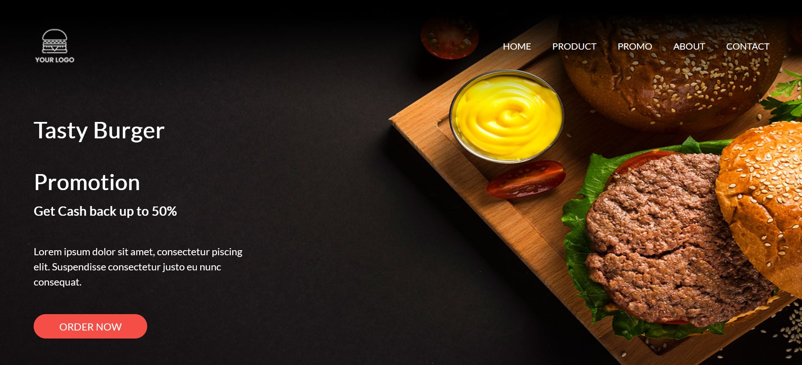

# Tasty Burger 🍔

Afin de me perfectionner sur Bootstrap et d'apprendre à utiliser SASS, j'ai réalisé la page internet d'un restauraut fictif nommé Tasty Burger, en anglais, spécialisé dans les hamburgers.

## Liens du site

Le site internet est accessible à tout visiteur à l'adresse suivante:
- [kitaah.github.io/tasty-burger](kitaah.github.io/tasty-burger)

## Langages

- **Front-end:** HTML, CSS, JavaScript, SASS (avec framework CSS Bootstrap, librairie d'icônes Font Awesome et librairie JavaScript AOS)

## Outils

- **IDE:** Visual Studio code
- **Gestion de version**: Git

&nbsp;&nbsp;&nbsp;&nbsp;&nbsp;&nbsp;&nbsp;&nbsp;&nbsp;&nbsp;

## Screenshot

 

